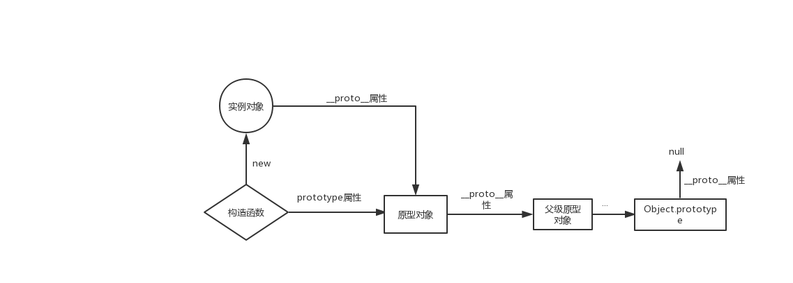

## 什么是原型

> 在javaScript中，每当定义一个数据类型(如函数，对象)的时候，都会随之创建一个prototype属性，这个属性指向函数的原型对象

> 当一个函数通过new这个关键字调用时，这个函数就是一个构造函数，返回一个全新实例对象，这个实例对象有个__prto__属性指向这个构造函数的原型对象

> 总结：原型就是对象或者函数定义的时候所自带prototype属性，而它指向这个函数或者对象的原型对象

代码示例：

```js
const person = function(){}
const p1 = new person()
console.log(person.prototype === p1.__proto__) // true
```

如图所示：


## 如何理解原型链？

> JavaScript对象通过prototype指向父类对象，直到指向Object对象为止，这样就形成了一个原型指向的链条, 即原型链。



- 对象的 hasOwnProperty() 来检查对象自身中是否含有该属性
- 使用 in 检查对象中是否含有某个属性时，如果对象中没有但是原型链中有，也会返回 true


