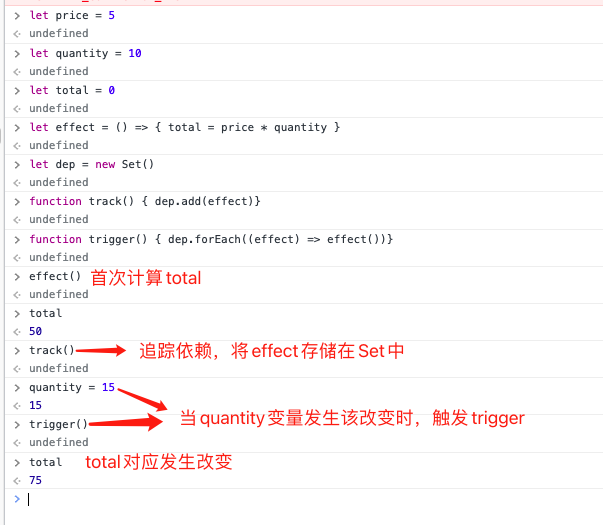
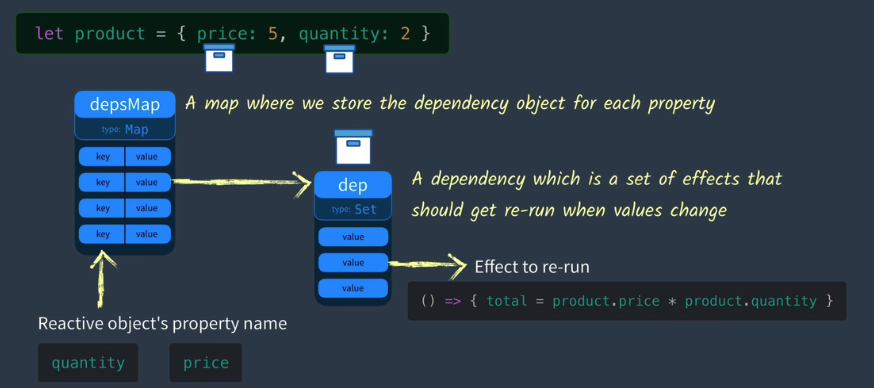

**先看一段Vue的基础模版**
- Vue
```js
    const vm = new Vue({
        el: '#app',
        data:{
            price: 10.00,
            quantity: 2
        },
        computed: {
            totalPriceWithTax(){
                return this.price * this.quantity * 1.03
            }
        }
    })
```
- template

```html
    <div id="app">
        <div>{{price}}</div>
        <div>{{quantity}}</div>
        <div>{{totalPriceWithTax}}</div>
    </div>
```

当price发生改变时，Vue是如何知道需要更新所有属性的？JavaScript通常的工作方式是不会更新的

```js
    let price = 5
    let quantity = 10
    let total = price * quantity

    console.log(total) // 10

    //当我们该改变price的值为20
    price = 20

    // 重新打印 total
    console.log(total) // total还是为10，total并没有得到更新，因为这里并没有响应式
```
**所以我们需要提出一个问题，我们如何怎样存储total的计算方式让price更新的时候让它在执行一次？**

> 将计算方式存储在某种storage，并且这个storage可能不止保存了一种功能（代码）

```js
    // 重新写一下示例
    let price = 5
    let quantity = 10
    let total = 0
    
    // 将计算方式的匿名函数存储在名为effect的变量中
    let effect = () => { total = price * quantity } //这就是我们想要存储的代码

    // 当我们想要保存effect中的代码时，我们需要执行一下track函数
    track()
    // 然后执行effect来计算首次总数
    effect()
    // 在某个时刻调用trigger来运行所有存储的代码
    trigger()
```
**为了存储我们的effect我们将使用dep变量**
```js
let dep = new Set() // 表明了一种依赖关系
```
**为了跟踪我们的依赖，需要将effect添加到Set中去**
```js
function track() { dep.add(effect)} // Set去重特性保证了effect的唯一性
```
**tigger函数就会遍历dep中的每个effect并执行**
```js
function trigger() { dep.forEach((effect) => { effect() })}
```


**通常情况下一个对象有许多属性，而每个属性都需要有自己的dep（依赖关系），那么我们如何让每个属性都有自己的依赖呢？**

```js
let product = {price:5,quantity:2}
```
如图：map就是一张存储每个属性其dep的表

key指向属性名，value指向dep

代码的实现：
```js
const depsMap = new Map()
function track(key){
    let dep = depsMap.get(key) //获取到的是keyValue也就是effectFn
    if(!dep){
        depsMap.set(key,{dep = new Set()})
    }
    dep.add(effect)
}
function trigger(key){
    let dep = depsMap.get(key)
    if(dep){
        dep.forEach((effect) => { effect() })
    }
}
```
代码的使用：
```js
    let product = {price:5,quantity:2}
    let effect = () = { product.price * product.quantity }
    track('quantity')  //追踪依赖
    effect() // total = 10
    product.quantity = 3
    trigger('quantity') // total = 15 重新执行了effect
```
这样就解决了让响应式对象的每个属性都有其自己的dep(依赖)。

**那么如果还有多个响应式对象呢？**
```js
let product = { price:5,quantity:2 }
let user = { name: 'lzh',age: 18 }
```