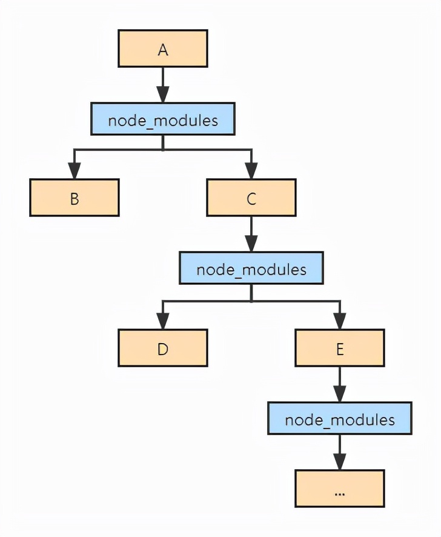

## 前言

对比npm、yarn、pnpm，以及它们都解决了哪些痛点？

## 为什么需要包管理器？

一个完成的项目或多或少有用到一些依赖，这些依赖是别人为了解决了一些问题而写好的代码（即第三方库），而这些依赖有可能一会用到第三方库来实现功能。那么为什么不自己造轮子呢？因为相对没那么可靠，第三方库是经过多方测试、兼容性和健壮性都比自己写的好。那么当依赖升级的时候，令人头疼的版本管理就出现了，包管理器的出现也解决了这些问题。

它提供方法给你安装依赖(即安装一个包)，管理包的存储位置，而且你可以发布自己写的包。

## npm早起版本（v1-v2）
早期的npm包管理器文件结构：

这样的文件结构会造就以下几点问题：
- node_modules包过大（大量重复包被安装在项目中）
- 依赖的文件路径太长（嵌套太深）
- 模块实例不能共享

## yarn & npm v3
扁平化的文件结构

扁平化的文件结构很好处理了依赖的文件路径太长（嵌套太深）的问题，因为所有的依赖都被放在了node_modules目录下
在执行install命令的时候如果发现有些依赖已经被装过了就不会装了，这样也解决了大量包被重复安装的问题

但扁平化又带来了新的问题
- 幽灵依赖（即package.json只声明A的依赖，但是因为扁平化的管理，B-F因为A依赖到到了它们所以被放在了与A相同的层级，理论上我们只可以使用A但实际上我们还可以使用B-F）这样会造成B-F升级版本后项目可能会出现问题并且排查相对困难
- 扁平化算法本身复杂性高，耗时过长
- 依赖结构的不确定性

**依赖结构的不确定性举例**
假如B和C都依赖了D，但是依赖的版本不一样，B依赖D@1.0，C依赖D@2.0，具体的版本是package.json声明顺序决定的，后面声明的会覆盖前面的依赖

## pnpm

