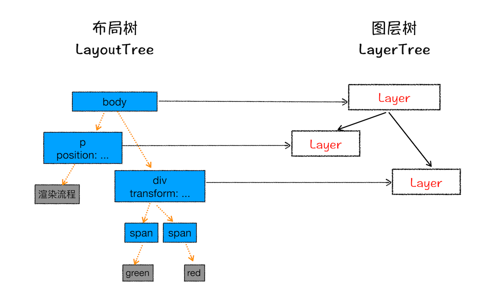
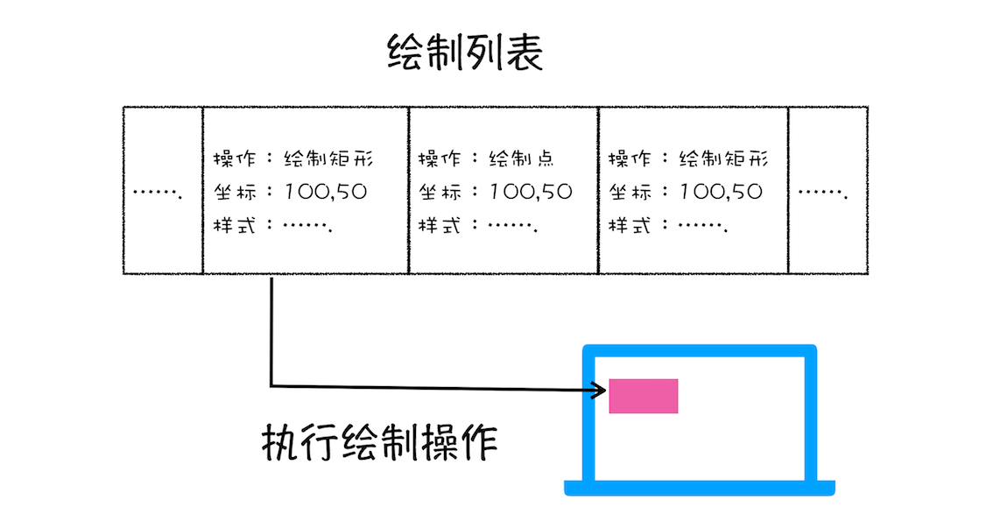

## 前言
> 当服务器返回渲染文件(HTML/CSS/JS)，浏览器是读不懂这些文件的(臣妾做不到啊！！！)
> 必须经过一系列的转化过程:
> - 构建DOM树
> - 样式计算
> - 布局（layout）
> - 构建、绘制图层（Paint）
> - 栅格化（raster）
> - 合成


## 构建DOM树

构建DOM树的目的就是将HTML文件的内容构建成浏览器能够理解的树结构


## 样式计算
生成DOM树之后,就要将CSS文件、内联样式、style标记里的样式转化为浏览器可以理解的结构——**styleSheets(可以在Chrome控制台中查看其结构，只需要在控制台中输入document.styleSheets)**
**styleSheets也可以称为CSSOM**


除了转化为**styleSheets**结构还需要转换样式表中的属性值，使其标准化
标准化的意思就是像一些rem，em需要根据对应的字体大小进行等值转换，比如一些颜色值，将会转换成RGB的格式


然后将标准化的**styleSheet**结合到DOM树上,也就是计算DOM树中每个节点的样式属性了。

**这里涉及到CSS的继承规则和层叠规则**

继承简单的理解就是子节点继承父节点的样式
可以想象一下这样一张样式表是如何应用到DOM节点上的。
```css
body { font-size: 20px }
p {color:blue;}
span  {display: none}
div {font-weight: bold;color:red}
div  p {color:green;}
```
合到上面的DOM树上计算出来的每个节点的具体样式为：

样式计算过程中，会根据DOM节点的继承关系来合理计算节点样式

层叠规则指的是当网页的元素发生层叠时的表现规则。具体可以看看 **<<CSS世界-张鑫旭著>>**里的第七章

## 布局阶段

虽然经过了构建DOM树和样式计算已经有了DOM树和样式，但还无法得知DOM元素的几何位置信息，那么计算DOM树中可见元素的位置信息这个阶段叫做布局阶段。

布局阶段需要经过**构建布局树**和**布局计算**两个程序

### 构建布局树(layoutTree)
> 由于DOM树中有不可见的元素，比如html、meta标签以及一些样式为display：none的元素。
所以生成布局树就是需要将这些不可见的元素忽略掉并将可见的DOM树节点加入到布局树中。

当浏览器解析完html片段后，会触发layout tree的构建，遍历所有DOM节点，每个非不可见的元素会被加入到布局树中，并建立父子兄弟关系。

### 布局计算(重排过程)

布局计算是一个递归的过程，因为一个节点的大小通常需要先计算它的子女节点的位置，大小等信息。每当发生重排时也就是每当元素几何位置属性发生更改时，那么浏览器就会重新布局、绘制以及之后的一系列操作。

元素的几何位置属性：宽度、margin、盒模型的数据结构、位置、浮动

布局计算就是计算元素的几何位置属性值，如果元素有子节点则会递归这个一个过程，通过上面的层层计算，就可以拿到位置坐标和具体大小保存到布局树中。

## 构建图层（Paint）

这个阶段是根据LayoutTree生成对应的图层树（layerTree）两者之间的关系如图所示：


可看到并不是每个DOM节点都需要构建图层，只有满足构建图层的条件才会有对应的图层。

**那需要满足什么样的条件，浏览器的渲染引擎才会为该节点创建图层呢？**

**1、拥有层叠上下文属性的元素会被提升为单独的一层**

> 层叠上下文就是HTML中三维的概念，可以理解为浏览器创建图层的标识。如果一个元素含
有层叠上下文，我们可以理解为这个元素在 z 轴上就离用户越近。
z 轴:表示的是用户与显示器之间这条看不见的垂直线。

**层叠上下文的特性：**
- **层叠上下文还具有内部层叠上下文及其所有子元素均受制于外部的“层叠上下文”**
- **每个层叠上下文和兄弟元素独立，也就是说，当进行层叠变化或渲染的时候，只需要考虑后代元素。**
- **每个层叠上下文是自成体系的，当元素发生层叠的时候，整个元素被认为是在父层叠上下文的层叠顺序中**

层叠上下文的属性有：
- z-index值不为auto的position:relative/position:absolute定位元素。
- position:fixed，仅限Chrome浏览器，其他浏览器遵循上一条，需要z-index为数值。
- z-index值不为auto的flex项(父元素display:flex|inline-flex).
- 元素的opacity值不是1.
- 元素的transform值不是none.
- 元素mix-blend-mode（混合模式）值不是normal.
- 元素的filter值不是none.
- will-change指定的属性值为上面任意一个。
- 元素的-webkit-overflow-scrolling设为touch.

**2、需要剪裁（clip）的地方也会被创建为图层**

这里的剪裁是当前元素内容溢出元素的所定的宽*高，并且设置了overflow：auto属性，这时候就产生了剪裁，渲染引擎会把裁剪文字内容的一部分用于显示在div区域，下图是示例：


## 图层绘制

**产生绘制指令，组成待绘制列表**】

渲染引擎绘制图层会把一个图层的绘制分成若干个小的绘制指令，然后再把这些指令按照顺序组成一个待绘制列表



**栅格化（raster）操作**
绘制列表只是用来记录绘制顺序和绘制指令的列表，而实际上绘制操作是由渲染引擎中的合成线程来完成的。
通常一个页面可能很大，但是用户只能看到其中的一部分，我们把用户可以看到的这个部分叫做视口（viewport）。

在有些情况下，有的图层可以很大，比如有的页面你使用滚动条要滚动好久才能滚动到底部，但是通过视口，用户只能看到页面的很小一部分，所以在这种情况下，要绘制出所有图层内容的话，就会产生太大的开销，而且也没有必要。

基于这个原因，合成线程会将图层划分为图块（tile）然后合成线程会按照视口附近的图块来优先生成位图，实际生成位图的操作是由栅格化来执行的。
**栅格化：将图块转换为位图。而图块是栅格化执行的最小单位**

渲染进程维护了一个维护了一个栅格化的线程池，所有的图块栅格化都是在线程池内执行的

由于栅格化过程都会使用GPU来加速生成，使用GPU生成位图的过程叫快速栅格化，或者GPU栅格化，所以最终生成的位图保存在GPU进程内存中，如图所示：


## 总结


完整的渲染流程：
- 浏览器渲染进程将HTML文件通过HTML解析器超文本标记语言（HTML）转化为DOM树
- 浏览器渲染进程将CSS样式（外部CSS文件、style样式、内联样式）转化为styleSheets（CSSOM）
- 创建布局树（layoutTree）、布局计算
- 创建图层树（layerTree）、生成绘制列表、并提交到合成线程
- 合成线程将图层分成图块，并在光栅化线程池中将图块转换成位图。
- 合成线程发送绘制图块命令DrawQuad给浏览器进程。
- 浏览器进程根据DrawQuad消息生成页面，并显示到显示器上