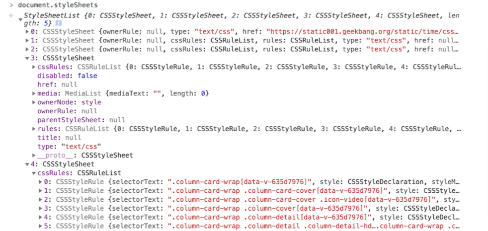

## 前言
> 当服务器返回渲染文件(HTML/CSS/JS)，浏览器是读不懂这些文件的(臣妾做不到啊！！！)
> 必须经过一系列的转化过程:
> - 构建DOM树
> - 样式计算
> - 布局（layout）
> - 构建、绘制图层（Paint）
> - 栅格化（raster）
> - 合成


## 构建DOM树

构建DOM树的目的就是将HTML文件的内容构建成浏览器能够理解的树结构


## 样式计算
生成DOM树之后,就要将CSS文件、内联样式、style标记里的样式转化为浏览器可以理解的结构——**styleSheets(可以在Chrome控制台中查看其结构，只需要在控制台中输入document.styleSheets)**
**styleSheets也可以称为CSSOM**



除了转化为**styleSheets**结构还需要转换样式表中的属性值，使其标准化
标准化的意思就是像一些rem，em需要根据对应的字体大小进行等值转换，比如一些颜色值，将会转换成RGB的格式


然后将标准化的**styleSheet**结合到DOM树上,也就是计算DOM树中每个节点的样式属性了。

**这里涉及到CSS的继承规则和层叠规则**

继承简单的理解就是子节点继承父节点的样式
可以想象一下这样一张样式表是如何应用到DOM节点上的。
```css
body { font-size: 20px }
p {color:blue;}
span  {display: none}
div {font-weight: bold;color:red}
div  p {color:green;}
```
合到上面的DOM树上计算出来的每个节点的具体样式为：

样式计算过程中，会根据DOM节点的继承关系来合理计算节点样式

层叠规则指的是当网页的元素发生层叠时的表现规则。具体可以看看 **<<CSS世界-张鑫旭著>>**里的第七章

## 布局阶段

虽然经过了构建DOM树和样式计算已经有了DOM树和样式，但还无法得知DOM元素的几何位置信息，那么计算DOM树中可见元素的位置信息这个阶段叫做布局阶段。

布局阶段需要经过**构建布局树**和**布局计算**两个程序

### 构建布局树(layoutTree)
> 由于DOM树中有不可见的元素，比如html、meta标签以及一些样式为display：none的元素。
所以生成布局树就是需要将这些不可见的元素忽略掉并将可见的DOM树节点加入到布局树中。

当浏览器解析完html片段后，会触发layout tree的构建，遍历所有DOM节点，每个非不可见的元素会被加入到布局树中，并建立父子兄弟关系。

### 布局计算(重排)

布局计算是一个递归的过程，因为一个节点的大小通常需要先计算它的子女节点的位置，大小等信息。每当发生重排时也就是每当元素几何位置属性发生更改时，那么浏览器就会重新布局、绘制以及之后的一系列操作。

元素的几何位置属性：宽度、margin、盒模型的数据结构、位置、浮动

布局计算就是计算元素的几何位置属性值，如果元素有子节点则会递归这个一个过程，通过上面的层层计算，就可以拿到位置坐标和具体大小保存到布局树中。

## 构建、绘制图层（Paint）


